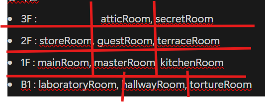
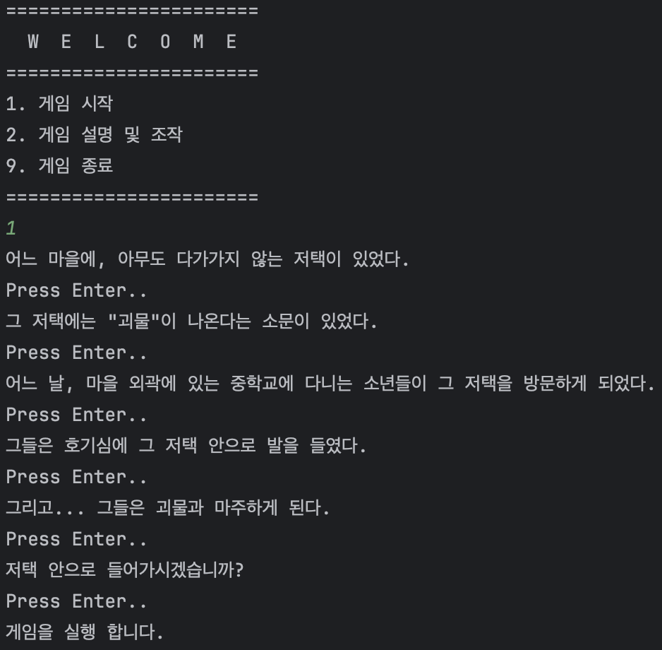
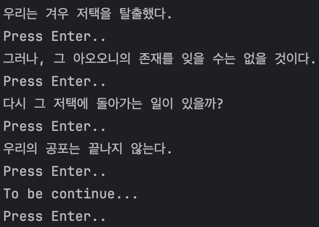
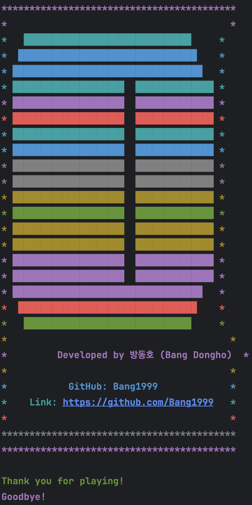
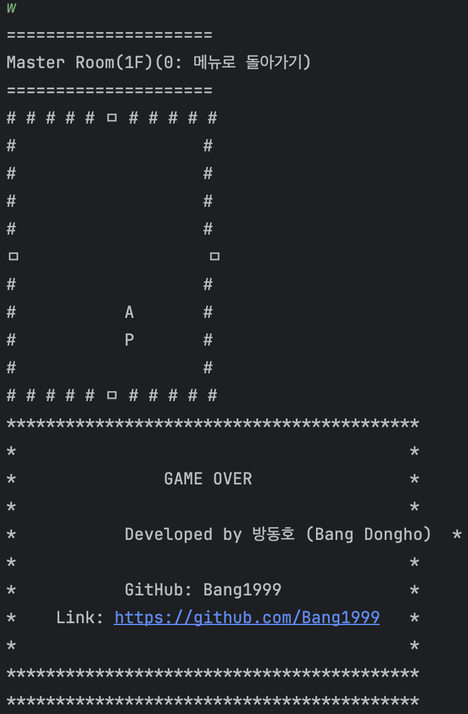
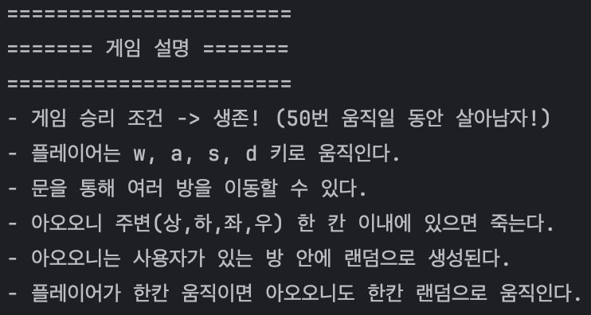
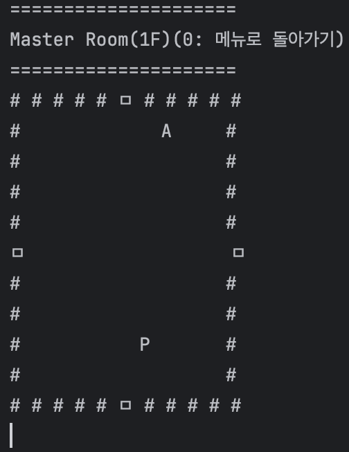

# Ao-oni

> Mini Console Game(With JAVA jdk 17)

---
## Game Rule
- 게임 승리 조건 -> 생존! (50번 움직일 동안 살아남자!)
- 플레이어는 w, a, s, d 키로 움직인다.
- 문을 통해 여러 방을 이동할 수 있다.
- 아오오니 주변(상,하,좌,우) 한 칸 이내에 있으면 죽는다.
- 아오오니는 사용자가 있는 방 안에 랜덤으로 생성된다.
- 플레이어가 한칸 움직이면 아오오니도 한칸 랜덤으로 움직인다.

---
## 집 구조

	      <<  집 구조   >>
					
	           다락방 -> 비밀의 방
	           
	            계단
	
	     창고 <-거실 -> 테라스
	
	            계단
	
	      방 <- 거실 -> 부억
	
	            계단
	
	    실험실 <-지하길-> 고문방

​			

---
## 오프닝

## 엔딩

## 게임 오버

## 게임 설명

## 인 게임

---
## 만든 목적
- 자바와 더 친해지기 위함.(다형성, 상속, 객체 생성 등등 여러가지를 사용해보자!)

---

# 회고

게임의 구조는 웹 계층과는 전혀 다르다는 것을 느꼈다. 그리고 게임은 왕초보인 내가 감당하기에는 고려해야할 것들이 너무 많다고 생각하여 여기까지하고 본 목적은 달성하여 마무리하였다.

