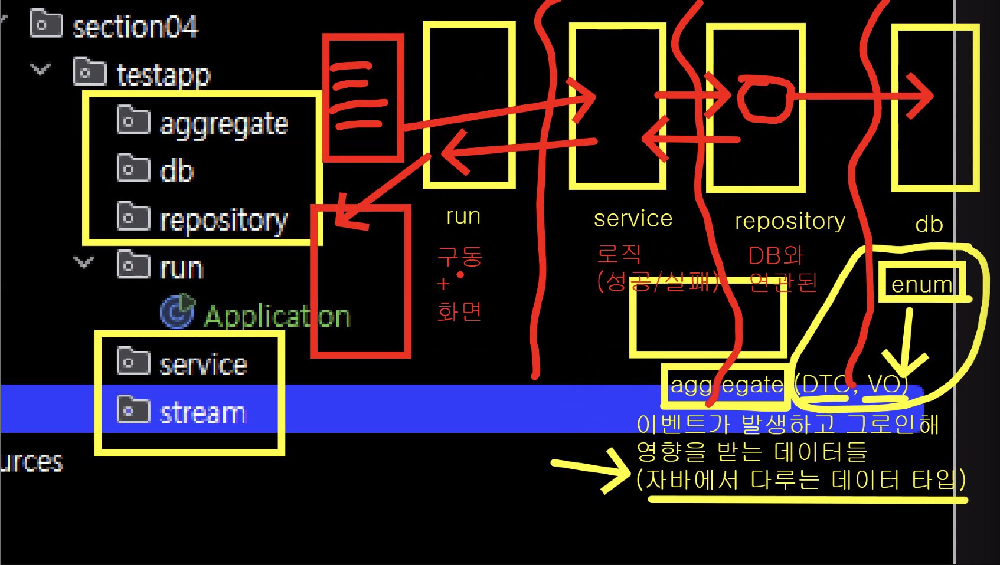
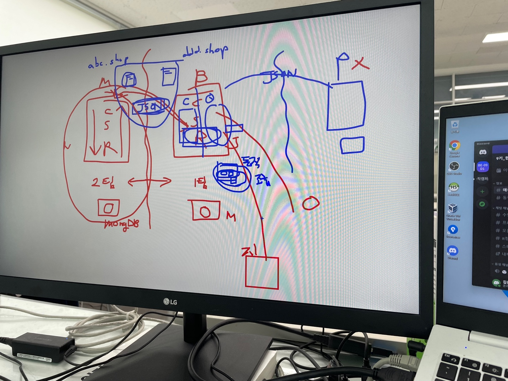

# play-ground

> Just CRUD Project
> Before Web Project Feel Web CRUD Flow

### Member : CRUD practice
([방동호](https://github.com/Bang1999)&nbsp;&nbsp;&nbsp;&nbsp; [정준서](https://github.com/JeongJunSeo99))

### Post : CRUD practice
([기우석](https://github.com/woosuk1)&nbsp;&nbsp;&nbsp;&nbsp; [송의혁](https://github.com/euihyeok-song))

### Product : CRUD practice
([용길한](https://github.com/Yong-ga-ri)&nbsp;&nbsp;&nbsp;&nbsp; [이효진](https://github.com/jinjin0528))

- aggregate : 사용자 객체 설정
- db : .dat or .txt로 대체
- repository : db와 연동하는 곳
- run : 사용자 화면 & Application
- service : 비즈니스 로직 처리하는 곳
- stream : db의 file stream 처리하는 곳

# 회고

## 이제서야 알았습니다. CQRS(아직 적용 X)의 필요성을 느껴보는 프로젝트였구나!

- Controller의 필요한 이유
1. POST 도메인에서 MEMBER 도메인의 정보가 필요하면 POST의 service층에서 POST controller에게 요청을 보낸다.
2. POST controller에서 응답하기 위해 자신의 (controller -> service -> repository -> db -> repository -> service -> controller)로 해결을 한 후 MEMBER service에게 응답을 한다. (추후에 이 데이터를 json형식으로 주고 받는다.)
3. 이후 MEMBER service에서 요긴하게 활용.

- 그럼 각 도메인에서 Repository들을 Interface로 관리하면 안되나?
1. 그래서 Spring에 그런 Interface가 있다!!
2. 그 인터페이스는 기본적인 쿼리문을 작동시켜주는데 조회할 때 문제가 된다.
3. 조회할 때 가져오고 싶은 값, 형식 등이 다 다를 수도 있으니 이럴때 동적조회를 사용한다.
4. 이 동적 조회를 위해서는 우리가 코드를 직접 작성해서 사용해야한다.

- CQRS가 필요한 이유!?

  위와 같은 것들을 관리하기 위해 CQRS라는 개념이 생긴 것 같다.
---

### Branch naming convetions

- feature/: For developing new features
  - pattern should be 'feature/domain'
    - ex. feature/member
- bugfix/: To fix bugs in the code. Often created associated to an issue.
- hotfix/: To fix critical bugs in the production.

### commit message naming conventions
- feat: add new features
- docs: update documentation
- fix: update functions
- refactor: update structures without function changes
